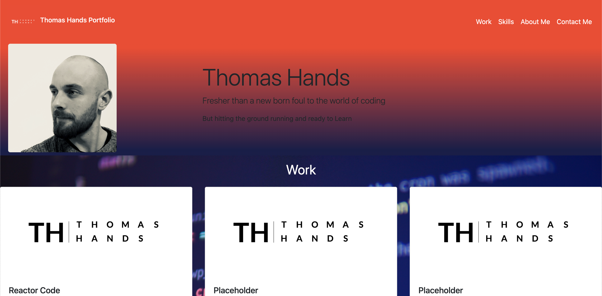
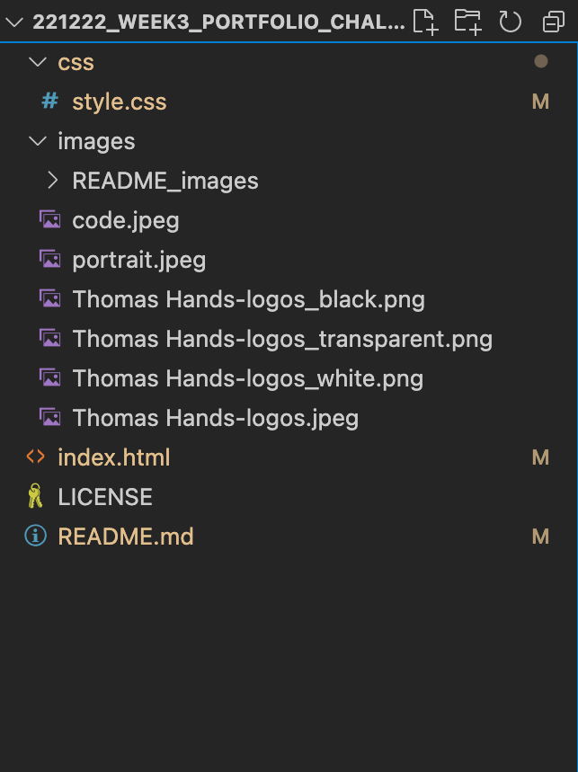

## Bootstrap-Portfolio

## Description 

This is a Student Portfolio Project for Bootcamp course with EDx using Bootstrap. This Pge contains HTML and CSS compontents using bootstrap to complete, with an example of the landing screen below

https://github.com/tjhandson/Bootstrap-Portfolio

## Installation

# Web browser - Chrome
To View the finished webpage downloading a Web browser, such as google chrome, is recomended. Please find the link too download below: https://www.google.co.uk/chrome/?brand=YTUH&gclid=EAIaIQobChMI5pKQxIr2-wIVwp7tCh3CoA27EAAYASAAEgI4jfD_BwE&gclsrc=aw.ds

With the instalation process noted below: https://support.google.com/chrome/answer/95346?hl=en-GB&co=GENIE.Platform%3DDesktop

However to view code and images 

# Git 
It is recomented to download Git if you are looking to interact with this public repo, Details on downloading this can be found here: https://github.com/git-guides/install-git

# VS Code
Visual Studio Code is a source-code editor (there are others available), The download for this cn be found on; https://code.visualstudio.com/download

## Usage 
This is a public repo and available to be run on either a webrowser or locally. 

# Run on Wb browser
Follow the link on: https://tjhandson.github.io/Bootstrap-Portfolio/

# Run Locally 

Clone project
git clone git@github.com:tjhandson/Bootstrap-Portfolio.git

Once downloaded the follow assers should be available within this folder:

## Credits

All taught Sourse material were provided by © 2022 edX Boot Camps LLC.

logo created with https://express.adobe.com

code.jpeg originally taken by aksonsat and can be found at https://as1.ftcdn.net/v2/jpg/02/09/60/56/1000_F_209605626_jl61fimPD2rLxoVadH4D3ITQzjAOK7Eu.jpg

## License

MIT License 2022 Please refer to the LICENSE in the repo.

## Contributing

---

© 2022 edX Boot Camps LLC. Confidential and Proprietary. All Rights Reserved.
